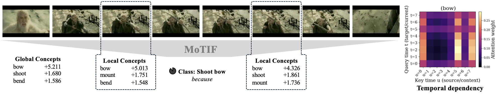

# MoTIF — Concepts in Motion

[](https://arxiv.org/abs/2509.20899)
[](https://huggingface.co/P4ddyki/MoTIF/tree/main)

MoTIF (Moving Temporal Interpretable Framework) extends concept bottleneck modeling from static images to videos. It combines concept activations from vision-language models with temporal modeling to explain video predictions through global concept importance, local concept windows, and temporal dependency maps.

Accepted as a spotlight non-archival paper at the XAI4CV CVPR Workshop 2026.



## Abstract

Concept Bottleneck Models (CBMs) enable interpretable image classification by structuring predictions around human-understandable concepts, but extending this paradigm to video remains challenging due to the difficulty of extracting concepts and modeling them over time. In this paper, we introduce MoTIF (Moving Temporal Interpretable Framework), a transformer-based concept architecture that operates on sequences of temporally grounded concept activations, by employing per-concept temporal self-attention to model when individual concepts recur and how their temporal patterns contribute to predictions. Central to the framework is a class-conditioned VLM-based concept discovery module that extracts object- and action-centric textual concepts from training videos, yielding temporally expressive concept sets without manual concept annotation. Across multiple video benchmarks, this combination improves over global concept bottlenecks and remains competitive within the interpretable concept-bottleneck setting, while narrowing the gap to strong black-box video baselines that we report as contextual references.

## Highlights

- Concept bottlenecks for video classification with temporal reasoning over concept activations
- Two training variants: temporal `MoTIF` and space-time `MoTIF-ST`
- Three explanation views: global relevance, local windows, and temporal attention maps
- Support for multiple vision-language backbones, including CLIP, SigLIP, CLIP4Clip, and Perception Encoder variants
- Optional agentic concept extraction pipeline for VLM-generated concepts and ablations
- Example workflows for UCF-101, HMDB-51, Something-Something v2, and Breakfast Actions

## Repository Contents

- `train_MoTIF.py`: train the temporal MoTIF model
- `train_MoTIF-ST.py`: train the space-time MoTIF-ST variant
- `embedding.py`: generate video embeddings used by the models
- `save_videos.py`: prepare derived `Video_data/` and `Image_data/` folders from raw datasets
- `MoTIF.ipynb`, `MoTIF-ST.ipynb`: inspect predictions, concepts, and explanations
- `Synthetic_temporal_pattern.ipynb`: synthetic temporal pattern experiments
- `interventions.ipynb`, `corrective_interventions_manual.ipynb`, `app_corrective_interventions.py`: intervention and correction workflows
- `slurm_cbm_extract_windows.sbatch`: example SLURM launcher for VLM-based concept extraction
- `MoTIF_DCBM_Style/`: DCBM-style concept extraction and ablation utilities
- `Videos/`: small example videos for qualitative inspection
- `Datasets/`, `Embeddings/`, `Models/`: placeholder folders for external data and generated artifacts
- `utils/`: model, embedding, explanation, intervention, and data-loading code

## What Is Not Stored in Git

Large artifacts are intentionally not tracked in this repository:

- trained checkpoints in `Models/`
- generated embeddings in `Embeddings/`
- raw datasets and derived `Video_data/` / `Image_data/` folders under `Datasets/`
- cache files, bytecode, and other local machine artifacts

Pretrained checkpoints are available on [Hugging Face](https://huggingface.co/P4ddyki/MoTIF/tree/main). Embeddings can be regenerated locally with `embedding.py`.

## Setup

MoTIF was run in our experiments with Python 3.13.5 on GPU machines. A CUDA-enabled GPU is strongly recommended, especially for embedding generation and training.

Install the main dependencies:

```bash
pip install -r requirements.txt
```

For VLM-based concept extraction with vLLM, install the extra dependencies as well:

```bash
pip install -r requirements_vllm.txt
```

## Data Layout

Place the original dataset files under `Datasets/<DatasetName>/Data/`. The preprocessing step then creates the derived `Video_data/` and `Image_data/` folders used by the training and concept extraction code.

Expected layout:

```text
Datasets/
  HMDB/
    Data/
    testTrainMulti_7030_splits/
    Video_data/
    Image_data/
  UCF101/
    Data/
    ucfTrainTestlist/
    Video_data/
    Image_data/
  Something2/
    Data/
    labels/
    Video_data/
    Image_data/
  Breakfast/
    Data/
    Video_data/
    Image_data/
```

Notes:

- `save_videos.py` reads from `Data/` and writes the derived `Video_data/` and `Image_data/` folders.
- The included HMDB split files under `Datasets/HMDB/testTrainMulti_7030_splits/` are lightweight metadata only.
- Dataset videos must be obtained from the original dataset providers and used under their respective licenses.

## Quickstart

### 1. Install dependencies

```bash
pip install -r requirements.txt
```

### 2. Place raw datasets under `Datasets/<DatasetName>/Data/`

Follow each dataset's official download instructions, then copy or extract the raw files into the matching `Data/` directory.

### 3. Create derived video and frame folders

Example:

```bash
python save_videos.py --dataset HMDB
```

The script supports the dataset names used in the codebase and creates the `Video_data/` and `Image_data/` directories expected by training and concept extraction.

### 4. Generate embeddings

```bash
python embedding.py
```

`embedding.py` currently contains an example configuration near the bottom of the file. Adjust the dataset, backbone, window size, and batching settings there before running large jobs.

### 5. Train the temporal MoTIF model

```bash
python train_MoTIF.py
```

### 6. Train the space-time MoTIF-ST model

```bash
python train_MoTIF-ST.py
```

### 7. Inspect checkpoints and explanations

Open the notebooks to visualize concepts, temporal attention, interventions, and prediction behavior:

- `MoTIF.ipynb`
- `MoTIF-ST.ipynb`
- `interventions.ipynb`
- `corrective_interventions_manual.ipynb`

## Pretrained Checkpoints

Pretrained checkpoints are available on [Hugging Face](https://huggingface.co/P4ddyki/MoTIF/tree/main). The repository currently includes released models for several dataset and backbone combinations, including PE-L/14 checkpoints for Breakfast, HMDB-51, and UCF-101.

To use a pretrained checkpoint:

1. Download the desired file from Hugging Face.
2. Place it in `Models/`.
3. Point the notebook or training/evaluation code to the matching checkpoint path.

## Backbones and Datasets

### Supported vision-language backbones

- CLIP ViT-B/32
- CLIP ViT-B/16
- CLIP ViT-L/14
- CLIP RN50
- CLIP4Clip
- SigLIP
- SigLIP SO400M L/14
- Perception Encoder PE-L/14
- Perception Encoder PE-G/14

### Example datasets

- UCF-101
- HMDB-51
- Something-Something v2
- Breakfast Actions

Using additional datasets is possible, but typically requires adapting the dataset handling in `utils/core/data/`, `embedding.py`, and the training scripts.

## Agentic Concept Extraction

This repository also includes an optional pipeline for extracting concepts from video frames with a vision-language model.

Typical workflow:

1. Install the extra dependencies from `requirements_vllm.txt`.
2. Start a vLLM server with a vision-language model.
3. Adapt `slurm_cbm_extract_windows.sbatch` to your environment.
4. Run concept extraction using the utilities in `MoTIF_DCBM_Style/` or `utils/extract_cbm_concepts_from_image_data_windows.py`.
5. Pass the generated concept directory to `train_MoTIF.py` or `train_MoTIF-ST.py` via the `agent_run_folder` setting when using agentic concepts.

The extraction pipeline supports ablation settings such as `json_only`, `json+action`, and `action_only`.

## Citation

If you use MoTIF in your research, please cite:

```bibtex
@misc{knab2025conceptsmotiontemporalbottlenecks,
  title={Concepts in Motion: Temporal Bottlenecks for Interpretable Video Classification},
  author={Patrick Knab and Sascha Marton and Philipp J. Schubert and Drago Guggiana and Christian Bartelt},
  year={2025},
  eprint={2509.20899},
  archivePrefix={arXiv},
  primaryClass={cs.CV},
  url={https://arxiv.org/abs/2509.20899}
}
```

## Acknowledgements

- Parts of `utils/core` are adapted from the Perception Encoder framework.
- Thanks to the CORE research group at TU Clausthal and Ramblr.ai Research for support.

## Contact

For questions, bug reports, or collaboration inquiries, please open a GitHub issue.
